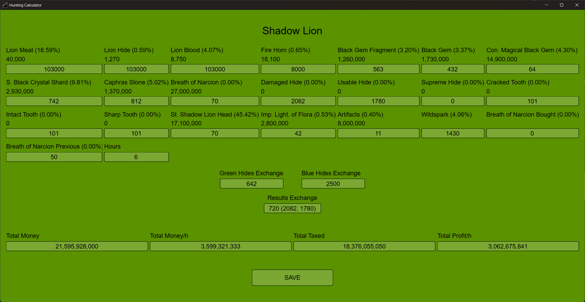

# 🦌 Hunting Calculator

A tool to calculate and optimize your hunting activities. Simplify strategic decisions and maximize rewards with personalized statistics and resources.


---

## 📸 Demo



---

## ✨ Specs

- 📊 Calculator of earning resources.
- 📈 Save statistics to check them afterwards.
- 🎯 Summarize results from saved files and check performance.
- 💰 Automatically calculates the optimal selling price based on current item supply and demand, intelligently maximizing your profits.

---

## 💾 Installation

1. Download .exe file from release section.
2. Move it into destination folder (Subfolders are created).
3. Run the executable (If a security prompt appears, choose “More info” → “Run anyway”).

---

## 📦 Clone

Clone repository:

```bash
git clone https://github.com/Dekyl/HuntingCalculator.git
cd HuntingCalculator
