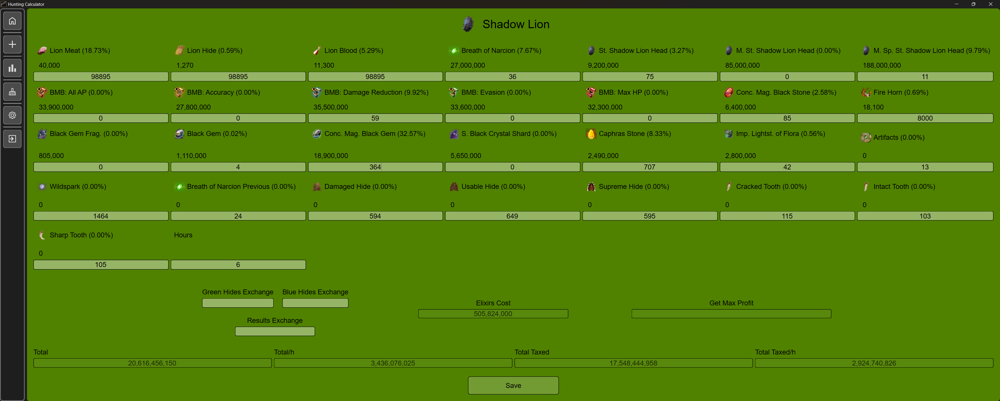
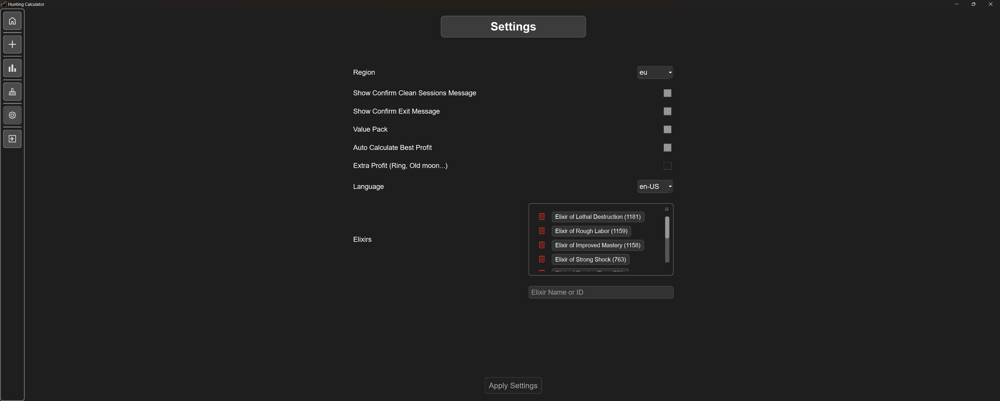

# 🦌 Hunting Calculator

A tool to calculate and optimize your hunting activities. Simplify strategic decisions and maximize rewards with personalized statistics and resources.


---

## 📸 Demo







---

## ✨ Specs

- 📊 Calculator of earning resources.
- 📈 Save statistics to check them afterwards.
- 🎯 Summarize results from saved files and check performance.
- 💰 Automatically calculates the optimal selling price based on current item supply and demand, intelligently maximizing your profits.

---

## 📋 Features

- **Calculator**: Calculate resources and earnings based on your hunting activities.
- **Statistics**: Save and analyze your hunting statistics to track progress.
- **Summarization**: Summarize results from saved files to evaluate your performance.
- **Selling Price**: Automatically calculate the optimal selling price based on current supply and demand to maximize profits.
- **API Integration**: Fetch real-time data from the game API to ensure accurate calculations.

---

## 📖 Settings

### ⚙️ Settings

- **Language**: Choose your preferred language. Available options: English.
- **Region**: Select your region. Available options: EU, NA (modifiable via the settings section).
- **Auto-Calculate**: Toggle auto-calculation of resources and earnings to maximize profits or manually input values based on your preference.
- **Value-Pack**: Enable or disable value pack benefits to adjust calculations for increased earnings based on your current game status.
- **Extra-Profit**: Activate or deactivate extra benefits from items like rings or old moon scrolls to gain an additional 5% profit when selling on the marketplace.

---

## 💾 Installation

1. Download .exe file from release section.
2. Move it into destination folder (Subfolders are created).
3. Run the executable (If a security prompt appears, choose “More info” → “Run anyway”).

---

## 📦 Clone

Clone repository:

```bash
git clone https://github.com/Dekyl/HuntingCalculator.git
cd HuntingCalculator
```

---

## 🔨 Build

Build .exe file:

```bash
./autobuild.bat
```
